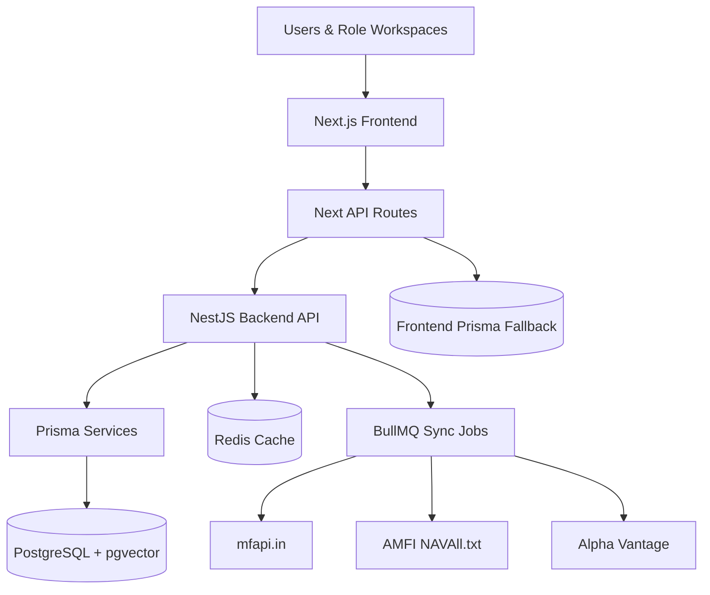

# Lumina

> Full-stack investment intelligence platform for mutual fund discovery, direct investing, portfolio monitoring, and role-based financial operations.

[](#)
[](#tech-stack)
[](#tech-stack)
[](#tech-stack)
[](#license)

---

## Overview

Lumina is a monorepo containing a **Next.js 14 frontend** at the repository root and a **NestJS 11 backend API** in [`backend/`](backend/). It is built around real fund data, PostgreSQL persistence, Redis-backed caching and queues, and separate workspaces for investors, advisors, AMC users, researchers, and admins.

> **Note:** Some external data providers require API keys or rate-limit-aware sync schedules before production use.

---

## Contents

- [Features](#features)
- [Architecture](#architecture)
- [Tech Stack](#tech-stack)
- [Repository Layout](#repository-layout)
- [Getting Started](#getting-started)
- [Quick Health Check](#quick-health-check)
- [Environment Variables](#environment-variables)
- [Common Commands](#common-commands)
- [Quality Gates](#quality-gates)
- [Deployment](#deployment)
- [API Overview](#api-overview)
- [Data Sources](#data-sources)
- [Troubleshooting](#troubleshooting)
- [Contributing](#contributing)
- [Security](#security)
- [License](#license)

---

## Features

- **Fund Discovery** — filtering, comparison, and focused scheme views
- **Investor Dashboard** — portfolio, goal planning, direct-invest, and payment review flows
- **Role Workspaces** — Advisor, AMC, Research, and Admin workspaces powered by shared role metadata
- **Real Backend Data** — stable `/api/*` frontend proxy routes to the NestJS API
- **NestJS Services** — funds, portfolios, orders, research, auth, KYC, market data, and reports
- **PostgreSQL + Prisma** — relational persistence with pgvector support
- **Redis + BullMQ** — fund sync jobs and operational workflow queues
- **Scheduled Ingestion** — mfapi.in, AMFI bulk NAV, Alpha Vantage, and optional live market feeds

---

## Architecture



### Request Flow

1. The UI calls frontend routes such as `/api/funds`, `/api/workspace`, or `/api/investments`.
2. The frontend normalizes responses and forwards backend-backed requests to `BACKEND_API_URL`.
3. The NestJS backend reads and writes through Prisma.
4. Redis caches fund responses and powers queue-backed sync jobs.
5. The frontend receives consistent JSON even when the backend is deployed at a different origin.

---

## Tech Stack

| Area | Tools |
|---|---|
| **Frontend** | Next.js 14, React 18, TypeScript, Tailwind CSS, Radix UI, Recharts, Zustand |
| **Backend** | NestJS 11, TypeScript, Prisma 7, BullMQ, Redis, WebSockets |
| **Database** | PostgreSQL 16, pgvector |
| **Auth** | NextAuth (frontend), JWT + role guards (backend) |
| **Data** | mfapi.in, AMFI NAVAll.txt, Alpha Vantage, optional Finnhub / Yahoo Finance |
| **Reports** | PDFKit, ExcelJS |
| **Local Infra** | Docker Compose, Adminer, Redis Commander |

---

## Repository Layout

```
.
├── src/
│   ├── app/                 # Next.js routes, dashboards, and API routes
│   ├── components/          # UI, landing, dashboard, fund, and layout pieces
│   ├── lib/                 # Backend client, Prisma, calculations, role data
│   └── store/               # Client-side state
├── backend/
│   ├── src/
│   │   ├── auth/            # Register, login, JWT, roles, KYC
│   │   ├── funds/           # Fund list, details, history, screener
│   │   ├── market-data/     # AMFI, mfapi, Alpha Vantage, sync workers
│   │   ├── orders/          # Direct-invest order flow
│   │   ├── portfolio/       # Portfolios, valuation, rebalance, reports
│   │   ├── research/        # Research reports and news
│   │   └── common/          # Prisma, Redis, queues, interceptors
│   └── prisma/
│       └── schema.prisma    # Backend database model
├── prisma/
│   └── schema.prisma        # Frontend auth/fallback database model
├── docker-compose.yml       # PostgreSQL, Redis, Adminer, Redis Commander
└── docker/postgres/init.sql # pgvector setup
```

---

## Getting Started

### Prerequisites

| Tool | Version |
|---|---|
| Node.js | 20 LTS or newer |
| npm | 10 or newer |
| Docker Desktop | Latest stable |
| Alpha Vantage API key | Optional — required for USA fund sync |

### 1. Clone the repository

```bash
git clone https://github.com/varunsahukar/Lumina.git
cd Lumina
```

### 2. Create environment files

```bash
cp .env.example .env
cp backend/.env.example backend/.env
```

The example values work for local Docker PostgreSQL and Redis. Replace API keys and secrets before using any shared or production environment.

### 3. Start local infrastructure

```bash
docker compose up -d
```

| Service | URL |
|---|---|
| PostgreSQL | `localhost:5432` |
| Redis | `localhost:6379` |
| Adminer | `http://localhost:8080` |
| Redis Commander | `http://localhost:8081` |

### 4. Install dependencies and generate Prisma clients

```bash
# Root (frontend)
npm install
npx prisma generate

# Backend
cd backend
npm install
npx prisma generate
cd ..
```

### 5. Run database migrations

```bash
cd backend
npx prisma migrate dev
cd ..
```

### 6. Start the backend

```bash
cd backend
npm run start:dev
```

If Redis is unavailable, build once and run in local mode:

```bash
cd backend
npm run build
npm run start:local
```

### 7. Start the frontend

Open a second terminal:

```bash
npm run dev
```

App is available at `http://localhost:3000`.

---

## Quick Health Check

Use these checks after starting the local stack.

| Check | Command | Expected Result |
|---|---|---|
| Frontend loads | `open http://localhost:3000` | Prototype or landing page opens |
| Backend responds | `curl http://localhost:3001/api/funds?market=INDIA\&limit=1` | JSON fund response |
| Frontend proxy works | `curl http://localhost:3000/api/funds?market=INDIA\&limit=1` | JSON with `success: true` |
| Prisma can generate | `npx prisma generate` | Client generated in `src/generated/prisma` |
| Backend builds | `cd backend && npm run build` | Nest build completes |

If the frontend proxy returns an HTML 404 page, check `BACKEND_API_URL`. It must include `/api`.

---

## Environment Variables

Both the frontend and backend use `.env` files. **Never commit real secrets to Git.**

### Frontend — `.env`

| Variable | Purpose |
|---|---|
| `PORT` | Frontend port (default `3000`) |
| `BACKEND_API_URL` | Server-side Nest API URL including `/api` prefix — e.g. `http://localhost:3001/api` or `https://your-backend.onrender.com/api` |
| `NEXT_PUBLIC_BACKEND_API_URL` | Browser-visible backend URL for client-side features. Use the same `/api`-suffixed URL only when client code must call the backend directly. |
| `DATABASE_URL` | Frontend Prisma database URL for auth/fallback data |
| `JWT_SECRET` | Local auth secret |

### Backend — `backend/.env`

| Variable | Purpose |
|---|---|
| `PORT` | Backend port (default `3001`) |
| `DATABASE_URL` | PostgreSQL connection string |
| `JWT_SECRET` | JWT signing secret |
| `MFAPI_BASE_URL` | Indian mutual fund API base URL |
| `AMFI_NAV_URL` | AMFI bulk NAV text feed |
| `INDIA_SCHEME_CODES` | Comma-separated Indian scheme codes to sync |
| `ALPHA_VANTAGE_KEY` | Alpha Vantage key for USA fund data |
| `USA_TICKERS` | Comma-separated USA tickers to sync |
| `ENABLE_REDIS` | Set to `false` to run backend without Redis |
| `REDIS_HOST` / `REDIS_PORT` | Redis connection settings |
| `AMFI_SYNC_CRON` / `USA_SYNC_CRON` | Scheduled sync cron expressions |

---

## Common Commands

### Frontend

Run from the repository root.

| Command | Description |
|---|---|
| `npm run dev` | Start the Next.js development server |
| `npm run build` | Build the frontend |
| `npm run start` | Serve the production build |
| `npm run lint` | Run lint |

### Backend

Run from `backend/`.

| Command | Description |
|---|---|
| `npm run start:dev` | Start NestJS in watch mode |
| `npm run build` | Compile backend and copy generated Prisma assets |
| `npm run start:local` | Run compiled backend with Redis disabled |
| `npm run start:prod` | Run compiled backend in production mode |
| `npm run test` | Run unit tests |
| `npm run test:e2e` | Run end-to-end tests |
| `npm run lint` | Run backend linting |

---

## Quality Gates

Run these checks before opening a pull request or promoting a build.

```bash
# Frontend
npm run lint
npm run build

# Backend
cd backend
npm run lint
npm run build
npm run test -- --runInBand
```

> **Note:** The backend lint task intentionally ignores generated Prisma output in `backend/src/generated/`. Regenerate the client with `cd backend && npx prisma generate` after schema changes.

For production deployments, also confirm:

- `BACKEND_API_URL` points at the deployed Nest API
- `DATABASE_URL`, `JWT_SECRET`, provider keys, and Redis settings are correct per environment
- Migrations have been applied: `cd backend && npx prisma migrate deploy`
- Redis is available when `ENABLE_REDIS` is not set to `false`

---

## Deployment

Refer to [`docs/deployment.md`](docs/deployment.md) for the full staging/production checklist. It covers required environment variables, migration commands, Redis requirements, PostgreSQL SSL-mode handling, and recommended hosting options.

**Pre-promote check:**

```bash
# Full stack
DEPLOY_ENV=production npm run check:deployment

# Backend only
cd backend
DEPLOY_ENV=production npm run check:deployment
npm run migrate:deploy
```

---

## API Overview

### Frontend API Routes

These routes keep the UI decoupled from the backend host.

| Method | Route | Purpose |
|---|---|---|
| `GET` | `/api/funds` | Fund catalog |
| `GET` | `/api/funds/:id` | Fund detail |
| `GET` | `/api/funds/:id/history` | NAV/performance history |
| `GET` | `/api/screener` | Filtered fund screen |
| `GET` | `/api/dashboard` | Investor dashboard data |
| `GET` | `/api/portfolio` | Portfolio summary |
| `GET` / `POST` | `/api/investments` | Investment summary and direct-invest records |
| `GET` | `/api/workspace?role=INVESTOR` | Role-specific workspace data |
| `POST` | `/api/ai` | AI-assisted research and summaries |

### Backend API Routes

The NestJS app is served under `/api`.

| Area | Routes |
|---|---|
| **Auth** | `POST /api/auth/register`, `POST /api/auth/login`, `GET /api/auth/me`, KYC endpoints |
| **Funds** | `GET /api/funds`, `GET /api/funds/:id`, `GET /api/funds/:id/history`, stats, refresh, compare, screen |
| **Portfolio** | `GET /api/portfolio`, `POST /api/portfolio`, valuation, rebalance, PDF and Excel reports |
| **Orders** | `POST /api/orders` |
| **Research** | `GET /api/research`, `GET /api/research/news`, `GET /api/research/:id` |

---

## Data Sources

| Source | Used For | Notes |
|---|---|---|
| [mfapi.in](https://mfapi.in) | Indian fund metadata and NAV history | No key required |
| AMFI NAVAll.txt | Bulk Indian NAV sync | Scheduled via cron |
| Alpha Vantage | USA fund quotes and metadata | API key required |
| Finnhub / Yahoo Finance | Optional live or extended market data | Feature-flagged |

The backend normalizes provider responses into Prisma models, writes sync logs, invalidates Redis fund caches, and exposes fresh data to the frontend.

---

## Troubleshooting

| Problem | Resolution |
|---|---|
| Backend cannot connect to Redis | Run `docker compose up -d redis`, or use `npm run start:local` after building the backend. |
| Frontend receives a Next.js 404 HTML page instead of API data | `BACKEND_API_URL` is missing the `/api` prefix or points at the frontend. Use the deployed Nest URL with `/api` — e.g. `https://your-backend.onrender.com/api` — then verify `/api/funds` returns JSON. |
| Frontend shows empty data | Confirm `BACKEND_API_URL=http://localhost:3001/api` locally (or the deployed URL in production), then check that `/api/funds` returns JSON. |
| Prisma client missing after backend build | Run `cd backend && npx prisma generate && npm run build`. |
| pgvector extension missing | Recreate the Docker database volume or run `CREATE EXTENSION IF NOT EXISTS vector;`. |
| PostgreSQL SSL-mode warning on startup | Set an explicit SSL mode in `DATABASE_URL` — e.g. `sslmode=verify-full` for strict SSL or `uselibpqcompat=true&sslmode=require` for libpq-compatible behavior. |
| USA data is stale | Verify `ALPHA_VANTAGE_KEY`, `USA_TICKERS`, and provider rate limits. |
| Role dashboards are empty | Sync funds first, then create portfolios, investments, or transactions. |

---

## Contributing

Contributions are easiest to review when they are small and focused.

1. Open an issue or describe the change before large rewrites.
2. Keep frontend requests going through the existing `/api/*` route contract.
3. Keep backend configuration environment-driven.
4. Run the relevant build or test command before opening a pull request.
5. Do not commit `.env`, local database dumps, generated secrets, or provider keys.

**Suggested local checks before submitting:**

```bash
npm run lint
npm run build
cd backend && npm run lint && npm run build && npm run test -- --runInBand
```

---

## Security

- Never commit real credentials to the repository.
- Rotate `JWT_SECRET` and all provider keys per environment.
- Validate payment amounts, order values, NAV figures, units, and totals server-side.
- Keep admin, advisor, AMC, and research routes behind role guards.
- Use HTTPS and secure cookies in production.

---

## License

No open-source license is currently included. Until a `LICENSE` file is added, this code is not automatically available for reuse or redistribution. Add a `LICENSE` file before accepting external open-source contributions.
