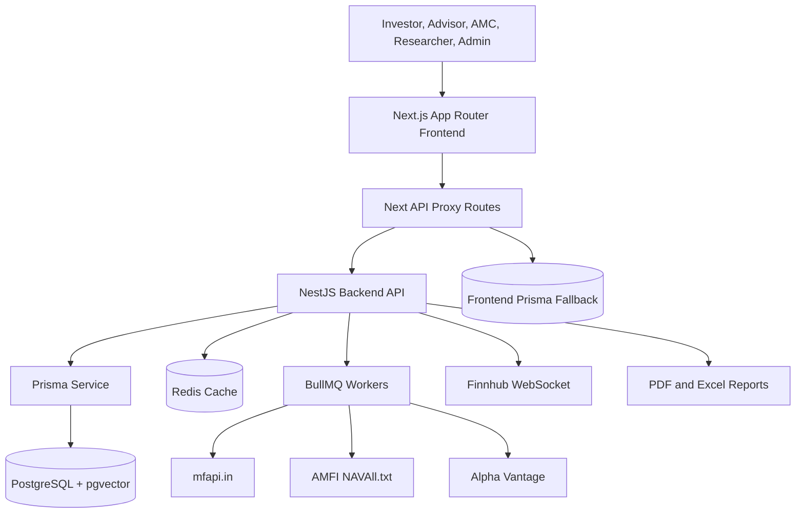
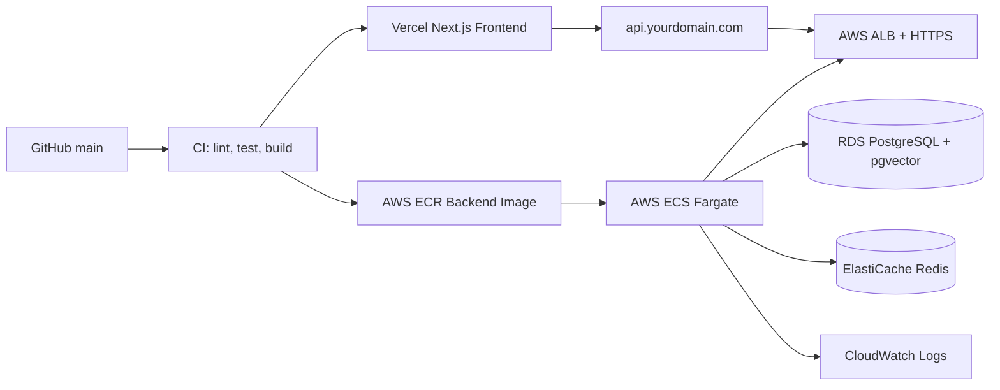

# Lumina

Lumina is a full-stack investment intelligence platform for mutual-fund discovery, portfolio monitoring, advisor workspaces, AMC operations, research workflows, and admin oversight. The application combines a Next.js investor console with a NestJS data API, PostgreSQL plus pgvector, Redis-backed background jobs, and live market-data integrations.

This repository contains the frontend at the project root and the backend API inside `backend/`.

## Product Surface

| Area | What it does |
| --- | --- |
| Landing experience | Animated market dashboard, focused fund scheme highlights, real data summaries, and light/dark mode. |
| Investor console | Fund screener, fund detail pages, portfolio dashboard, direct-invest flow, payment review, and goal planning. |
| Advisor workspace | Client and portfolio operating metrics generated from application data. |
| AMC control | Fund product, AUM, category, and operational views generated from fund data. |
| Research hub | Research and insights workspace backed by fund, market, and research API data. |
| System admin | Platform health, users, portfolios, transactions, and sync visibility. |
| Backend API | Funds, screeners, portfolios, orders, research, auth, KYC, reports, Redis cache, and BullMQ sync jobs. |

## Architecture



The frontend keeps the public `/api/*` contract stable while proxying to the NestJS API through `BACKEND_API_URL`. When the backend is unavailable for selected dashboard surfaces, the frontend can fall back to the local Prisma database so the UI remains usable during development.

## Tech Stack

| Layer | Stack |
| --- | --- |
| Frontend | Next.js 14, React 18, App Router, TypeScript, Tailwind CSS, shadcn-style UI primitives, Recharts, Zustand |
| Auth | NextAuth, Prisma adapter, role-aware backend guards |
| Backend | NestJS 11, TypeScript, Prisma 7, BullMQ, Redis, WebSockets, schedule jobs |
| Database | PostgreSQL 16 with pgvector |
| Market data | mfapi.in, AMFI bulk NAV, Alpha Vantage, optional Yahoo Finance and Finnhub |
| Reports | PDFKit and ExcelJS |
| Local infrastructure | Docker Compose, Adminer, Redis Commander |

## Repository Layout

```text
.
|-- src/
|   |-- app/                 # Next.js routes, dashboards, API proxy routes
|   |-- components/          # UI, landing, fund, screener, portfolio components
|   |-- lib/                 # Backend API client, Prisma, calculations, data helpers
|   `-- store/               # Client state
|-- backend/
|   |-- src/
|   |   |-- auth/            # Register, login, JWT, roles, KYC
|   |   |-- funds/           # Fund listing, detail, comparison, screener
|   |   |-- market-data/     # AMFI, mfapi, Alpha Vantage, Finnhub, sync workers
|   |   |-- orders/          # Direct-invest order orchestration
|   |   |-- portfolio/       # Portfolio, valuation, rebalance, reports
|   |   |-- research/        # Research and market insights
|   |   `-- common/          # Prisma, Redis, queues, interceptors
|   `-- prisma/schema.prisma # Backend data model
|-- prisma/schema.prisma     # Frontend Prisma model used by NextAuth and fallbacks
|-- docker-compose.yml       # Postgres, Redis, Adminer, Redis Commander
`-- docker/postgres/init.sql # pgvector bootstrap
```

## Prerequisites

- Node.js 20 LTS or newer
- npm 10 or newer
- Docker Desktop
- PostgreSQL client tools are optional but useful for debugging
- Alpha Vantage key for USA fund sync
- Redis for cache and BullMQ workers, unless running the backend with `ENABLE_REDIS=false`

## Environment Setup

Create local environment files from the examples:

```bash
cp .env.example .env
cp backend/.env.example backend/.env
```

Important variables:

| Variable | Used by | Purpose |
| --- | --- | --- |
| `PORT` | Frontend and backend | `3000` for Next.js, `3001` for NestJS. |
| `BACKEND_API_URL` | Frontend | Server-side URL for the NestJS API, normally `http://localhost:3001/api`. |
| `NEXT_PUBLIC_BACKEND_API_URL` | Frontend | Browser-visible backend URL when needed by client surfaces. |
| `DATABASE_URL` | Frontend and backend | PostgreSQL connection string. |
| `JWT_SECRET` | Backend and auth | Secret for JWT signing and validation. Replace in every deployed environment. |
| `MFAPI_BASE_URL` | Backend | Indian mutual-fund API base URL. |
| `AMFI_NAV_URL` | Backend | AMFI bulk NAV text feed. |
| `INDIA_SCHEME_CODES` | Backend | Initial India fund scheme codes for sync. |
| `ALPHA_VANTAGE_KEY` | Backend | USA fund data key. |
| `USA_TICKERS` | Backend | USA fund tickers to sync. |
| `ENABLE_REDIS` | Backend | Enables Redis cache and BullMQ jobs. Use `false` for local backend-only startup. |
| `REDIS_HOST`, `REDIS_PORT` | Backend | Redis connection details. |
| `AMFI_SYNC_CRON`, `USA_SYNC_CRON` | Backend | Scheduled sync intervals. |

Never commit real secrets. Keep production values in your deployment provider or secret manager.

## Local Development

Start local infrastructure:

```bash
docker compose up -d
```

Install and build the frontend:

```bash
npm install
npm run build
```

Install and build the backend:

```bash
cd backend
npm install
npm run build
```

Run the backend in one terminal:

```bash
cd backend
npm run start:dev
```

If Redis is not running locally, use the Redis-disabled startup path:

```bash
cd backend
npm run start:local
```

Run the frontend in another terminal:

```bash
npm run dev
```

Open:

| Service | URL |
| --- | --- |
| Frontend | `http://localhost:3000` |
| Backend API | `http://localhost:3001/api` |
| Adminer | `http://localhost:8080` |
| Redis Commander | `http://localhost:8081` |

## Database

The application uses Prisma with PostgreSQL and pgvector.

```bash
cd backend
npx prisma generate
npx prisma migrate dev
```

For the root frontend Prisma client:

```bash
npx prisma generate
```

The Docker Postgres service loads `docker/postgres/init.sql` on first boot to enable the pgvector extension.

## Core API Surface

Frontend proxy routes:

| Route | Purpose |
| --- | --- |
| `GET /api/funds` | Fund listing used by landing, screener, and dashboards. |
| `GET /api/funds/:id` | Fund details. |
| `GET /api/funds/:id/history` | NAV and performance history. |
| `GET /api/screener` | Filtered fund screen. |
| `GET /api/dashboard` | Investor dashboard metrics. |
| `GET /api/portfolio` | Portfolio holdings and summary. |
| `POST /api/investments` | Direct-invest transaction flow. |
| `GET /api/workspace?role=...` | Role-specific Advisor, AMC, Research, Admin, and Investor workspace data. |
| `POST /api/ai` | AI-assisted research and summaries. |

Backend routes:

| Route | Purpose |
| --- | --- |
| `GET /api/funds` | Paginated and filtered fund catalog. |
| `GET /api/funds/stats/summary` | Fund and sync summary metrics. |
| `POST /api/funds/refresh` | Queue-backed fund refresh. |
| `GET /api/funds/categories` | Available fund categories. |
| `GET /api/funds/compare` | Fund comparison. |
| `GET /api/funds/screen` | Advanced screener. |
| `GET /api/funds/:id` | Fund detail. |
| `GET /api/funds/:id/history` | NAV history. |
| `GET /api/portfolio` | User portfolios. |
| `POST /api/portfolio` | Create portfolio. |
| `GET /api/portfolio/:id/valuation` | Portfolio valuation. |
| `POST /api/portfolio/:id/rebalance` | Rebalance recommendation. |
| `GET /api/portfolio/:id/report/pdf` | PDF report. |
| `GET /api/portfolio/:id/report/excel` | Excel report. |
| `POST /api/orders` | Create an investment order. |
| `GET /api/research` | Research reports. |
| `GET /api/research/news` | Market news. |
| `POST /api/auth/register` | User registration. |
| `POST /api/auth/login` | User login. |
| `GET /api/auth/me` | Current user profile. |
| `POST /api/auth/kyc/initiate` | Start KYC. |
| `POST /api/auth/kyc/pan` | PAN verification. |
| `GET /api/auth/kyc` | KYC status. |

## Data Sync

Lumina syncs fund data from multiple sources:

| Source | Role |
| --- | --- |
| mfapi.in | Indian scheme metadata and NAV history. |
| AMFI NAVAll.txt | Bulk Indian NAV refresh. |
| Alpha Vantage | USA fund quotes and metadata. |
| Finnhub WebSocket | Optional live USA market ticks. |

The backend writes normalized fund and NAV history records through Prisma, logs sync status in `SyncLog`, invalidates Redis fund cache keys, and exposes fresh data to the Next.js frontend through stable API routes.

## Scripts

Frontend:

| Command | Description |
| --- | --- |
| `npm run dev` | Start Next.js development server. |
| `npm run build` | Build the production frontend. |
| `npm run start` | Start the built Next.js app. |
| `npm run lint` | Run Next linting. |

Backend:

| Command | Description |
| --- | --- |
| `npm run start:dev` | Start NestJS in watch mode. |
| `npm run start:local` | Start built backend with Redis disabled. |
| `npm run build` | Type-check/build backend and copy generated Prisma assets. |
| `npm run start:prod` | Run the compiled backend. |
| `npm run test` | Run Jest tests. |
| `npm run test:e2e` | Run end-to-end tests. |
| `npm run lint` | Run backend ESLint. |

## Production Deployment

Recommended production topology:



Deployment notes:

- Run Prisma migrations before promoting a backend image.
- Set `BACKEND_API_URL` and `NEXT_PUBLIC_BACKEND_API_URL` to the production API origin.
- Store `DATABASE_URL`, `JWT_SECRET`, provider keys, and Redis credentials as encrypted secrets.
- Use Redis in production for cache, queue processing, rate limiting, and sync retry behavior.
- Keep external data provider rate limits in mind, especially Alpha Vantage free-tier limits.
- Put the backend behind HTTPS and restrict administrative routes with role guards.

## Verification Checklist

Use these checks before pushing production changes:

```bash
npm run build
cd backend
npm run build
npm run test
```

Runtime smoke checks:

```bash
curl http://localhost:3001/api
curl "http://localhost:3001/api/funds?market=INDIA&limit=5"
curl http://localhost:3000/api/funds
```

## Troubleshooting

| Symptom | Fix |
| --- | --- |
| Backend logs `ECONNREFUSED 127.0.0.1:6379` | Start Redis with `docker compose up -d redis` or run `npm run start:local` from `backend/`. |
| Frontend shows empty or stale data | Confirm `BACKEND_API_URL=http://localhost:3001/api` and that the backend responds to `/api/funds`. |
| Prisma generated client is missing in backend build | Run `cd backend && npx prisma generate && npm run build`. |
| pgvector extension is missing | Recreate the Docker database volume or apply `CREATE EXTENSION IF NOT EXISTS vector;`. |
| Alpha Vantage data does not update | Confirm `ALPHA_VANTAGE_KEY`, `USA_TICKERS`, and provider rate limits. |
| Dashboard role panels look empty | Seed or sync funds, then create portfolios or transactions through the investor flow. |

## Security

- Keep all secrets out of Git.
- Rotate `JWT_SECRET` and API provider keys per environment.
- Use role guards for Advisor, AMC, Researcher, and Admin surfaces.
- Keep payment/order flows server-validated; do not trust client-calculated NAV, units, or totals.
- Use HTTPS, secure cookies, and production NextAuth settings in deployed environments.

## Current Status

Lumina currently supports the end-to-end local flow for real fund data, investor dashboarding, role workspaces, and direct-invest payment review. Some external services depend on provider keys and rate limits, so production behavior should be validated against the target provider accounts before launch.

## License

This repository is private/internal unless a license is added.
