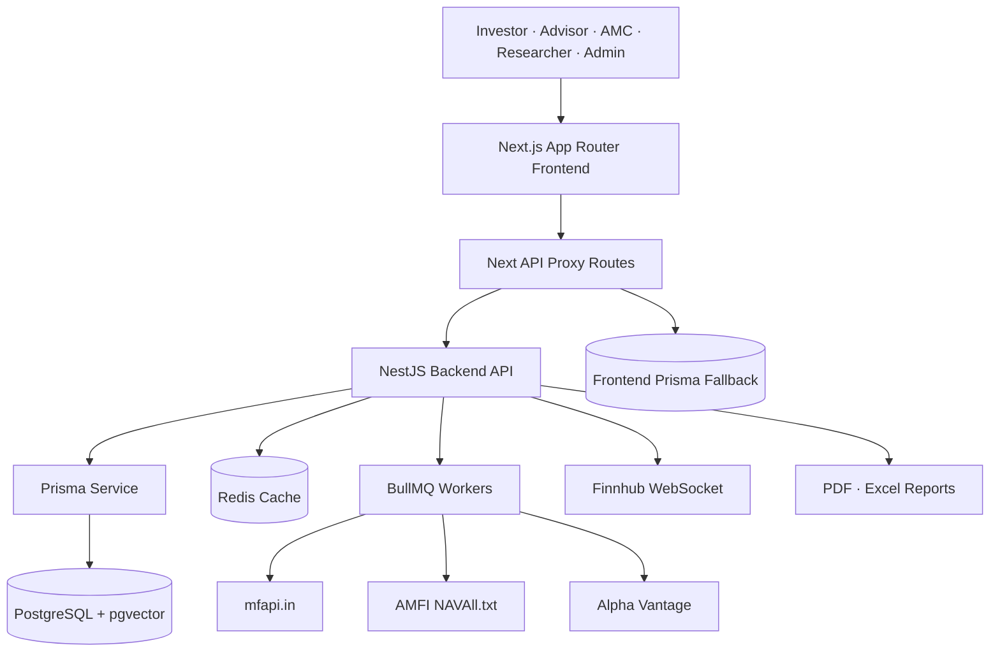
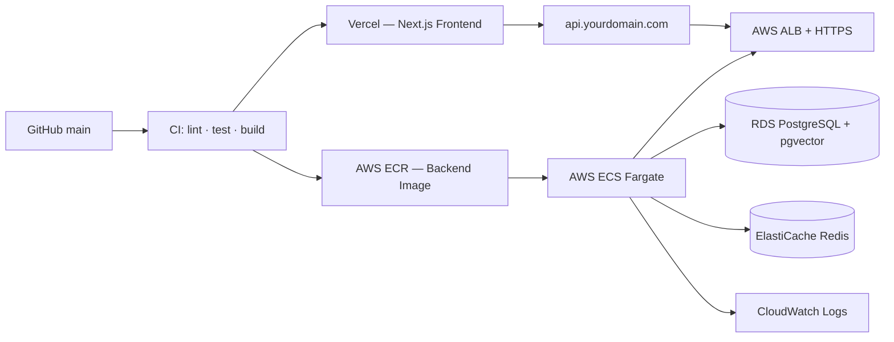

<div align="center">

# Lumina

**Full-stack investment intelligence platform for mutual fund discovery, portfolio monitoring, and role-based financial workspaces.**

[](https://nextjs.org)
[](https://nestjs.com)
[](https://www.typescriptlang.org)
[](https://www.postgresql.org)
[](https://redis.io)
[](#license)

[Overview](#overview) · [Architecture](#architecture) · [Tech Stack](#tech-stack) · [Getting Started](#getting-started) · [API Reference](#api-reference) · [Deployment](#deployment) · [Troubleshooting](#troubleshooting)

</div>

---

## Overview

Lumina is a production-grade investment intelligence platform covering the full lifecycle of mutual fund operations — from discovery and direct investment to portfolio rebalancing, research, and compliance. It serves five distinct user roles from a unified codebase:

| Role | What they can do |
|---|---|
| **Investor** | Screen and compare funds, track portfolio performance, initiate direct investments, plan goals |
| **Advisor** | Monitor client portfolios, view aggregated operating metrics |
| **AMC** | Manage fund products, AUM, categories, and operational views |
| **Researcher** | Access fund, market, and research data through a dedicated insights workspace |
| **Admin** | Oversee platform health, users, portfolios, transactions, and data sync status |

The repository ships the **Next.js frontend** at the root and the **NestJS backend API** under `backend/`.

---

## Architecture



**Key design decisions:**

- The frontend exposes a stable `/api/*` proxy contract and forwards requests to NestJS via `BACKEND_API_URL`, keeping the browser decoupled from the backend host.
- Selected dashboard surfaces can fall back to the local Prisma database when the NestJS API is unavailable, keeping the UI functional during development.
- Redis powers caching, BullMQ job queues for scheduled market-data sync, and rate-limiting in production.

---

## Tech Stack

| Layer | Technologies |
|---|---|
| **Frontend** | Next.js 14, React 18, App Router, TypeScript, Tailwind CSS, shadcn-style UI, Recharts, Zustand |
| **Auth** | NextAuth, Prisma adapter, role-aware backend guards |
| **Backend** | NestJS 11, TypeScript, Prisma 7, BullMQ, Redis, WebSockets, scheduled jobs |
| **Database** | PostgreSQL 16 with pgvector |
| **Market data** | mfapi.in, AMFI bulk NAV, Alpha Vantage, optional Yahoo Finance and Finnhub |
| **Reports** | PDFKit, ExcelJS |
| **Infrastructure** | Docker Compose, Adminer, Redis Commander |

---

## Repository Layout

```
.
├── src/
│   ├── app/                 # Next.js routes, dashboards, API proxy routes
│   ├── components/          # UI, landing, fund, screener, portfolio components
│   ├── lib/                 # Backend API client, Prisma, calculations, data helpers
│   └── store/               # Client-side state (Zustand)
├── backend/
│   ├── src/
│   │   ├── auth/            # Register, login, JWT, roles, KYC
│   │   ├── funds/           # Fund listing, detail, comparison, screener
│   │   ├── market-data/     # AMFI, mfapi, Alpha Vantage, Finnhub, sync workers
│   │   ├── orders/          # Direct-invest order orchestration
│   │   ├── portfolio/       # Portfolio, valuation, rebalance, reports
│   │   ├── research/        # Research and market insights
│   │   └── common/          # Prisma, Redis, queues, interceptors
│   └── prisma/schema.prisma # Backend data model
├── prisma/schema.prisma     # Frontend Prisma model (NextAuth + fallbacks)
├── docker-compose.yml       # Postgres, Redis, Adminer, Redis Commander
└── docker/postgres/init.sql # pgvector bootstrap
```

---

## Getting Started

### Prerequisites

- Node.js 20 LTS or newer
- npm 10 or newer
- Docker Desktop
- An **Alpha Vantage API key** for USA fund sync
- Redis (or use `ENABLE_REDIS=false` for a local backend-only startup)

### 1. Clone and configure environment

```bash
git clone https://github.com/varunsahukar/Lumina.git
cd Lumina

cp .env.example .env
cp backend/.env.example backend/.env
```

Open both `.env` files and fill in the values described in the [Environment Variables](#environment-variables) section below.

### 2. Start infrastructure

```bash
docker compose up -d
```

This starts PostgreSQL (with pgvector), Redis, Adminer, and Redis Commander.

### 3. Install dependencies and run database migrations

```bash
# Root (frontend)
npm install
npx prisma generate

# Backend
cd backend
npm install
npx prisma generate
npx prisma migrate dev
cd ..
```

### 4. Start the backend

```bash
cd backend
npm run start:dev          # With Redis
# or
npm run start:local        # Without Redis (dev only)
```

### 5. Start the frontend

```bash
npm run dev
```

### Running services

| Service | URL |
|---|---|
| Frontend | http://localhost:3000 |
| Backend API | http://localhost:3001/api |
| Adminer (DB UI) | http://localhost:8080 |
| Redis Commander | http://localhost:8081 |

---

## Environment Variables

Create both `.env` and `backend/.env` from their respective `.env.example` files. **Never commit real secrets.**

| Variable | Used by | Description |
|---|---|---|
| `PORT` | Frontend / Backend | `3000` for Next.js, `3001` for NestJS |
| `BACKEND_API_URL` | Frontend | Server-side URL for the NestJS API — `http://localhost:3001/api` locally |
| `NEXT_PUBLIC_BACKEND_API_URL` | Frontend | Browser-visible backend URL for client surfaces |
| `DATABASE_URL` | Frontend / Backend | PostgreSQL connection string |
| `JWT_SECRET` | Backend / Auth | JWT signing secret — rotate per environment |
| `MFAPI_BASE_URL` | Backend | Indian mutual fund API base URL |
| `AMFI_NAV_URL` | Backend | AMFI bulk NAV text feed URL |
| `INDIA_SCHEME_CODES` | Backend | Comma-separated India fund scheme codes for initial sync |
| `ALPHA_VANTAGE_KEY` | Backend | Alpha Vantage API key for USA fund data |
| `USA_TICKERS` | Backend | Comma-separated USA fund tickers to sync |
| `ENABLE_REDIS` | Backend | Set `false` to disable Redis and BullMQ in local dev |
| `REDIS_HOST` / `REDIS_PORT` | Backend | Redis connection details |
| `AMFI_SYNC_CRON` / `USA_SYNC_CRON` | Backend | Cron schedule for data sync jobs |

Store all production secrets in your deployment provider's secret manager, never in source control.

---

## Scripts

### Frontend

| Command | Description |
|---|---|
| `npm run dev` | Start Next.js development server |
| `npm run build` | Build the production frontend |
| `npm run start` | Serve the production build |
| `npm run lint` | Run ESLint |

### Backend

| Command | Description |
|---|---|
| `npm run start:dev` | Start NestJS in watch mode (requires Redis) |
| `npm run start:local` | Start compiled backend with Redis disabled |
| `npm run build` | Type-check, compile, and copy generated Prisma assets |
| `npm run start:prod` | Run the compiled production backend |
| `npm run test` | Run Jest unit tests |
| `npm run test:e2e` | Run end-to-end tests |
| `npm run lint` | Run ESLint |

---

## API Reference

### Frontend proxy routes

| Method | Route | Description |
|---|---|---|
| `GET` | `/api/funds` | Fund listing for landing page, screener, and dashboards |
| `GET` | `/api/funds/:id` | Fund detail |
| `GET` | `/api/funds/:id/history` | NAV and performance history |
| `GET` | `/api/screener` | Filtered fund screen |
| `GET` | `/api/dashboard` | Investor dashboard metrics |
| `GET` | `/api/portfolio` | Portfolio holdings and summary |
| `POST` | `/api/investments` | Direct-invest transaction flow |
| `GET` | `/api/workspace?role=...` | Role-specific workspace data (Advisor, AMC, Research, Admin, Investor) |
| `POST` | `/api/ai` | AI-assisted research and summaries |

### Backend routes

**Funds**

| Method | Route | Description |
|---|---|---|
| `GET` | `/api/funds` | Paginated, filtered fund catalog |
| `GET` | `/api/funds/stats/summary` | Fund and sync summary metrics |
| `POST` | `/api/funds/refresh` | Queue-backed fund data refresh |
| `GET` | `/api/funds/categories` | Available fund categories |
| `GET` | `/api/funds/compare` | Fund comparison |
| `GET` | `/api/funds/screen` | Advanced screener |
| `GET` | `/api/funds/:id` | Fund detail |
| `GET` | `/api/funds/:id/history` | NAV history |

**Portfolio**

| Method | Route | Description |
|---|---|---|
| `GET` | `/api/portfolio` | User portfolios |
| `POST` | `/api/portfolio` | Create a portfolio |
| `GET` | `/api/portfolio/:id/valuation` | Portfolio valuation |
| `POST` | `/api/portfolio/:id/rebalance` | Rebalance recommendation |
| `GET` | `/api/portfolio/:id/report/pdf` | Download PDF report |
| `GET` | `/api/portfolio/:id/report/excel` | Download Excel report |

**Orders & Research**

| Method | Route | Description |
|---|---|---|
| `POST` | `/api/orders` | Create an investment order |
| `GET` | `/api/research` | Research reports |
| `GET` | `/api/research/news` | Market news |

**Auth & KYC**

| Method | Route | Description |
|---|---|---|
| `POST` | `/api/auth/register` | User registration |
| `POST` | `/api/auth/login` | User login |
| `GET` | `/api/auth/me` | Current user profile |
| `POST` | `/api/auth/kyc/initiate` | Start KYC process |
| `POST` | `/api/auth/kyc/pan` | PAN verification |
| `GET` | `/api/auth/kyc` | KYC status |

---

## Data Sync

Lumina syncs fund data from multiple external sources on a scheduled basis:

| Source | Role |
|---|---|
| **mfapi.in** | Indian scheme metadata and NAV history |
| **AMFI NAVAll.txt** | Bulk Indian NAV refresh |
| **Alpha Vantage** | USA fund quotes and metadata |
| **Finnhub WebSocket** | Optional live USA market ticks |

The backend writes normalized fund and NAV history records via Prisma, logs sync status in `SyncLog`, invalidates Redis fund cache keys, and exposes fresh data to the frontend through stable API routes.

---

## Deployment

### Recommended production topology



### Deployment checklist

- Run `npx prisma migrate deploy` inside the backend container before promoting a new image.
- Set `BACKEND_API_URL` and `NEXT_PUBLIC_BACKEND_API_URL` to the production API origin.
- Store `DATABASE_URL`, `JWT_SECRET`, all provider keys, and Redis credentials as encrypted secrets in your deployment environment.
- Enable Redis in production — it is required for caching, BullMQ queue processing, rate limiting, and sync retry behavior.
- Be mindful of Alpha Vantage free-tier rate limits; validate sync cadence against your provider plan before launch.
- Place the backend behind HTTPS and enforce role guards on all administrative routes.

### Pre-deploy verification

```bash
# Build both services
npm run build
cd backend && npm run build

# Run tests
npm run test

# Smoke test a running stack
curl http://localhost:3001/api
curl "http://localhost:3001/api/funds?market=INDIA&limit=5"
curl http://localhost:3000/api/funds
```

---

## Troubleshooting

| Symptom | Resolution |
|---|---|
| Backend logs `ECONNREFUSED 127.0.0.1:6379` | Start Redis via `docker compose up -d redis`, or run the backend with `npm run start:local` to disable Redis. |
| Frontend shows empty or stale data | Verify `BACKEND_API_URL=http://localhost:3001/api` is set and the backend responds at `/api/funds`. |
| Prisma generated client missing in backend build | Run `cd backend && npx prisma generate && npm run build`. |
| pgvector extension missing | Recreate the Docker DB volume, or manually run `CREATE EXTENSION IF NOT EXISTS vector;` in your database. |
| Alpha Vantage data not updating | Check `ALPHA_VANTAGE_KEY` and `USA_TICKERS` are set and that you haven't hit the provider's rate limit. |
| Role workspace panels appear empty | Seed or sync fund data, then create portfolios or transactions via the investor flow to populate role dashboards. |

---

## Security

- Keep all secrets out of Git. Use `.env.example` files for documentation only.
- Rotate `JWT_SECRET` and all third-party API keys per deployment environment.
- Enforce role guards on Advisor, AMC, Researcher, and Admin surfaces.
- All payment and order flows must be validated server-side — never trust client-calculated NAV, units, or totals.
- Use HTTPS, secure cookies, and production-grade NextAuth configuration in every deployed environment.

---

## Current Status

Lumina supports the end-to-end local flow for real fund data, investor dashboarding, role-based workspaces, and direct-invest payment review. Some external integrations depend on third-party API keys and rate limits — validate provider accounts and sync schedules against production quotas before launch.

---

## License

This repository is private and internal. No open-source license has been applied. All rights reserved unless a license file is added.