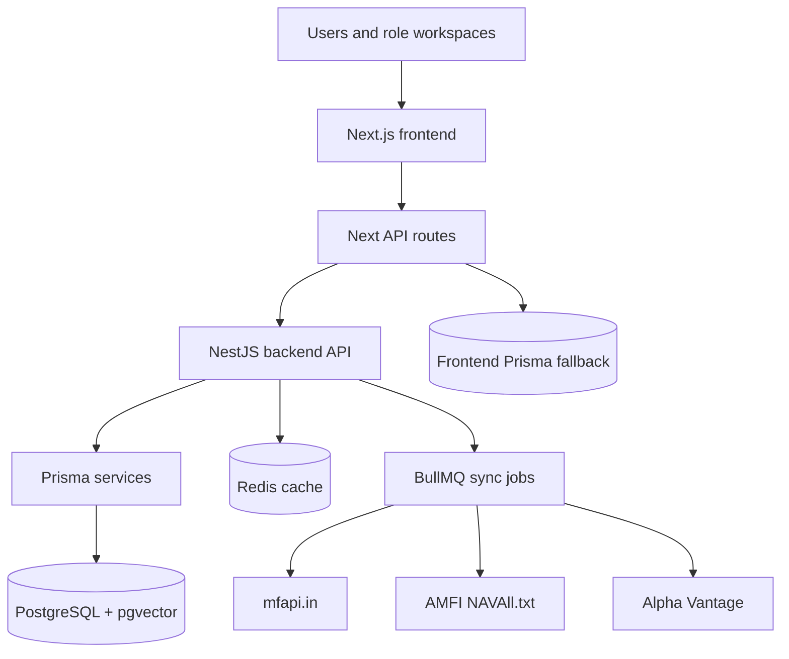

# Lumina

Lumina is a full-stack investment intelligence platform for mutual fund
discovery, direct investing, portfolio monitoring, and role-based financial
operations.

The project contains a **Next.js frontend** at the repository root and a
**NestJS backend API** in [`backend/`](backend/). It is designed around real fund
data, PostgreSQL persistence, Redis-backed caching and queues, and separate
workspaces for investors, advisors, AMC users, researchers, and admins.

> **Status:** active product build. Some external data providers require API
> keys or rate-limit-aware sync schedules before production use.

## Contents

- [Features](#features)
- [Architecture](#architecture)
- [Tech Stack](#tech-stack)
- [Repository Layout](#repository-layout)
- [Getting Started](#getting-started)
- [Environment Variables](#environment-variables)
- [Common Commands](#common-commands)
- [API Overview](#api-overview)
- [Data Sources](#data-sources)
- [Troubleshooting](#troubleshooting)
- [Contributing](#contributing)
- [License](#license)

## Features

- Fund discovery, filtering, comparison, and focused scheme views.
- Investor dashboard with portfolio, goal planning, direct-invest, and payment
  review flows.
- Advisor, AMC, Research, and Admin workspaces powered by shared role metadata.
- Real backend data through stable `/api/*` frontend routes.
- NestJS services for funds, portfolios, orders, research, auth, KYC, market
  data, and reports.
- PostgreSQL plus Prisma for persistence.
- Redis cache and BullMQ jobs for fund sync and operational workflows.
- Scheduled data ingestion from mfapi.in, AMFI bulk NAV, Alpha Vantage, and
  optional live market feeds.

## Architecture



### Request Flow

1. The UI calls frontend routes such as `/api/funds`, `/api/workspace`, or
   `/api/investments`.
2. The frontend normalizes responses for the app and forwards backend-backed
   requests to `BACKEND_API_URL`.
3. The NestJS backend reads and writes through Prisma.
4. Redis caches fund responses and powers queue-backed sync jobs.
5. The frontend receives consistent JSON even when the backend is deployed at a
   different origin.

## Tech Stack

| Area | Tools |
| --- | --- |
| Frontend | Next.js 14, React 18, TypeScript, Tailwind CSS, Radix UI, Recharts, Zustand |
| Backend | NestJS 11, TypeScript, Prisma 7, BullMQ, Redis, WebSockets |
| Database | PostgreSQL 16, pgvector |
| Auth | NextAuth on the frontend, JWT and role guards on the backend |
| Data | mfapi.in, AMFI NAVAll.txt, Alpha Vantage, optional Finnhub / Yahoo Finance |
| Reports | PDFKit, ExcelJS |
| Local infra | Docker Compose, Adminer, Redis Commander |

## Repository Layout

```text
.
├── src/
│   ├── app/                 # Next.js routes, dashboards, and API routes
│   ├── components/          # UI, landing, dashboard, fund, and layout pieces
│   ├── lib/                 # Backend client, Prisma, calculations, role data
│   └── store/               # Client-side state
├── backend/
│   ├── src/
│   │   ├── auth/            # Register, login, JWT, roles, KYC
│   │   ├── funds/           # Fund list, details, history, screener
│   │   ├── market-data/     # AMFI, mfapi, Alpha Vantage, sync workers
│   │   ├── orders/          # Direct-invest order flow
│   │   ├── portfolio/       # Portfolios, valuation, rebalance, reports
│   │   ├── research/        # Research reports and news
│   │   └── common/          # Prisma, Redis, queues, interceptors
│   └── prisma/schema.prisma # Backend database model
├── prisma/schema.prisma     # Frontend auth/fallback database model
├── docker-compose.yml       # PostgreSQL, Redis, Adminer, Redis Commander
└── docker/postgres/init.sql # pgvector setup
```

## Getting Started

### Prerequisites

- Node.js 20 LTS or newer
- npm 10 or newer
- Docker Desktop
- Optional: Alpha Vantage API key for USA fund sync

### 1. Clone the repository

```bash
git clone https://github.com/varunsahukar/Lumina.git
cd Lumina
```

### 2. Create environment files

```bash
cp .env.example .env
cp backend/.env.example backend/.env
```

For local development, the example values work for Docker PostgreSQL and Redis.
Replace API keys and secrets before using any shared or production environment.

### 3. Start local infrastructure

```bash
docker compose up -d
```

This starts:

| Service | URL |
| --- | --- |
| PostgreSQL | `localhost:5432` |
| Redis | `localhost:6379` |
| Adminer | `http://localhost:8080` |
| Redis Commander | `http://localhost:8081` |

### 4. Install dependencies and generate Prisma clients

```bash
npm install
npx prisma generate

cd backend
npm install
npx prisma generate
cd ..
```

### 5. Run database migrations

```bash
cd backend
npx prisma migrate dev
cd ..
```

### 6. Start the backend

```bash
cd backend
npm run start:dev
```

If Redis is not running, build once and start the backend in local mode:

```bash
cd backend
npm run build
npm run start:local
```

### 7. Start the frontend

In a second terminal:

```bash
npm run dev
```

Open `http://localhost:3000`.

## Environment Variables

Both the frontend and backend use `.env` files. Keep real secrets out of Git.

### Frontend `.env`

| Variable | Purpose |
| --- | --- |
| `PORT` | Frontend port, usually `3000` |
| `BACKEND_API_URL` | Server-side Nest API URL, for example `http://localhost:3001/api` |
| `NEXT_PUBLIC_BACKEND_API_URL` | Browser-visible backend URL for client features |
| `DATABASE_URL` | Frontend Prisma database URL for auth/fallback data |
| `JWT_SECRET` | Local auth secret |

### Backend `backend/.env`

| Variable | Purpose |
| --- | --- |
| `PORT` | Backend port, usually `3001` |
| `DATABASE_URL` | PostgreSQL connection string |
| `JWT_SECRET` | JWT signing secret |
| `MFAPI_BASE_URL` | Indian mutual fund API base URL |
| `AMFI_NAV_URL` | AMFI bulk NAV text feed |
| `INDIA_SCHEME_CODES` | Comma-separated Indian scheme codes to sync |
| `ALPHA_VANTAGE_KEY` | Alpha Vantage key for USA fund data |
| `USA_TICKERS` | Comma-separated USA tickers to sync |
| `ENABLE_REDIS` | Set to `false` for local backend startup without Redis |
| `REDIS_HOST` / `REDIS_PORT` | Redis connection settings |
| `AMFI_SYNC_CRON` / `USA_SYNC_CRON` | Scheduled sync cron expressions |

## Common Commands

### Frontend

| Command | Description |
| --- | --- |
| `npm run dev` | Start the Next.js development server |
| `npm run build` | Build the frontend |
| `npm run start` | Serve the production frontend build |
| `npm run lint` | Run the Next.js lint task |

### Backend

Run these from `backend/`.

| Command | Description |
| --- | --- |
| `npm run start:dev` | Start NestJS in watch mode |
| `npm run build` | Compile the backend and copy generated Prisma assets |
| `npm run start:local` | Run the compiled backend with Redis disabled |
| `npm run start:prod` | Run the compiled backend |
| `npm run test` | Run unit tests |
| `npm run test:e2e` | Run end-to-end tests |
| `npm run lint` | Run backend linting |

## API Overview

### Frontend API Routes

These routes are consumed by the Next.js app and keep the UI decoupled from the
backend host.

| Method | Route | Purpose |
| --- | --- | --- |
| `GET` | `/api/funds` | Fund catalog |
| `GET` | `/api/funds/:id` | Fund detail |
| `GET` | `/api/funds/:id/history` | Fund NAV/performance history |
| `GET` | `/api/screener` | Filtered fund screen |
| `GET` | `/api/dashboard` | Investor dashboard data |
| `GET` | `/api/portfolio` | Portfolio summary |
| `GET` / `POST` | `/api/investments` | Investment summary and direct-invest records |
| `GET` | `/api/workspace?role=INVESTOR` | Role-specific workspace data |
| `POST` | `/api/ai` | AI-assisted research and summaries |

### Backend API Routes

The NestJS app is served under `/api`.

| Area | Routes |
| --- | --- |
| Auth | `POST /api/auth/register`, `POST /api/auth/login`, `GET /api/auth/me`, KYC endpoints |
| Funds | `GET /api/funds`, `GET /api/funds/:id`, `GET /api/funds/:id/history`, stats, refresh, compare, screen |
| Portfolio | `GET /api/portfolio`, `POST /api/portfolio`, valuation, rebalance, PDF and Excel reports |
| Orders | `POST /api/orders` |
| Research | `GET /api/research`, `GET /api/research/news`, `GET /api/research/:id` |

## Data Sources

| Source | Used for | Notes |
| --- | --- | --- |
| mfapi.in | Indian fund metadata and NAV history | No key required |
| AMFI NAVAll.txt | Bulk Indian NAV sync | Scheduled by cron |
| Alpha Vantage | USA fund quotes and metadata | API key required |
| Finnhub / Yahoo Finance | Optional live or extended market data | Feature-flagged |

The backend normalizes provider responses into Prisma models, writes sync logs,
invalidates Redis fund caches, and exposes fresh data to the frontend.

## Troubleshooting

| Problem | What to check |
| --- | --- |
| Backend cannot connect to Redis | Run `docker compose up -d redis`, or use `npm run start:local` after building the backend. |
| Frontend shows empty data | Confirm `BACKEND_API_URL=http://localhost:3001/api` and check `http://localhost:3001/api/funds`. |
| Prisma client is missing after backend build | Run `cd backend && npx prisma generate && npm run build`. |
| pgvector extension is missing | Recreate the Docker database volume or run `CREATE EXTENSION IF NOT EXISTS vector;`. |
| USA data is stale | Check `ALPHA_VANTAGE_KEY`, `USA_TICKERS`, and provider rate limits. |
| Role dashboards are empty | Sync funds first, then create portfolios, investments, or transactions. |

## Contributing

Contributions are easiest to review when they are small and focused.

1. Open an issue or describe the change before large rewrites.
2. Keep frontend requests going through the existing `/api/*` route contract.
3. Keep backend configuration environment-driven.
4. Run the relevant build or test command before opening a pull request.
5. Do not commit `.env`, local database dumps, generated secrets, or provider
   keys.

Suggested local checks:

```bash
npm run build
cd backend && npm run build
```

## Security

- Never commit real credentials.
- Rotate `JWT_SECRET` and provider keys per environment.
- Validate payment, order, NAV, units, and totals on the server.
- Keep admin, advisor, AMC, and research routes behind role checks.
- Use HTTPS and secure cookies in production.

## License

No open-source license file is currently included. Until a license is added, the
code is not automatically available for reuse or redistribution. Add a
`LICENSE` file before accepting external open-source contributions.
